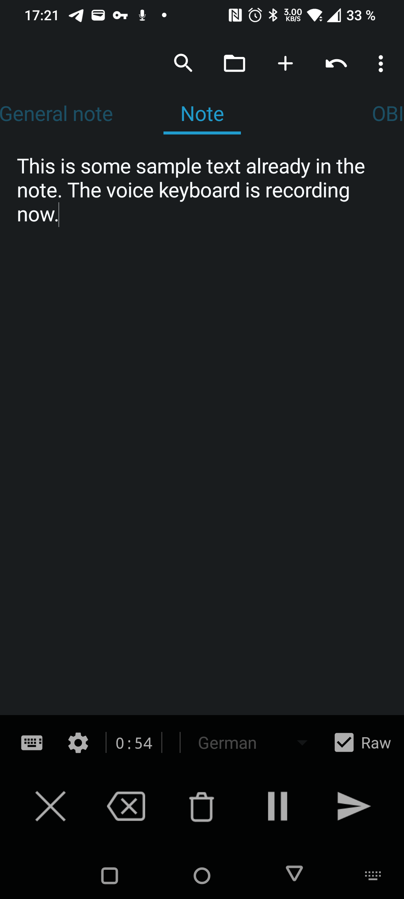
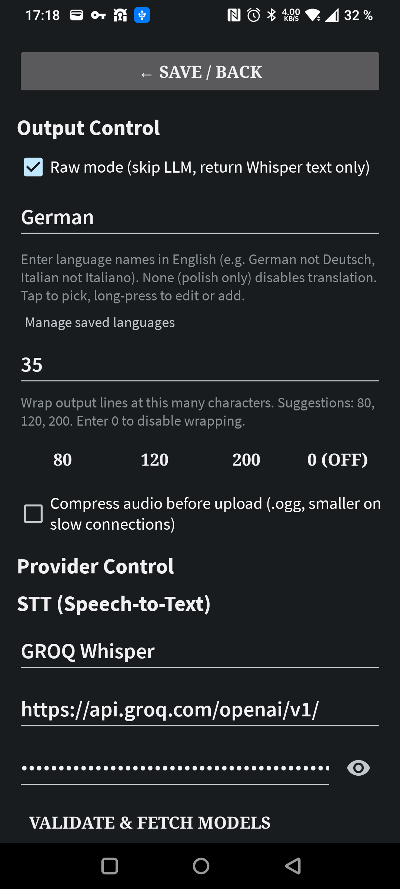

# Polished Recognition

**A voice keyboard powered by your own AI.**

Tap the mic, speak, and polished text appears — transcribed by the speech
provider *you* choose, refined by the language model *you* choose, with a
prompt *you* write. Bring your own API key (or run a local model) and take
full control of your voice input.

Polished Recognition installs as a **voice keyboard**: switch to it, and it
starts listening immediately — no extra tap, no learning a new typing UI.

|  |  |
|:---:|:---:|
| The voice keyboard — recording | Your pipeline, your prompts |

## How it works

1. **Switch to the Polished keyboard** → recording starts instantly
2. **Speak naturally** — pause/resume anytime mid-sentence
3. **Tap send** → audio goes to your STT provider (Whisper on GROQ, OpenAI, …)
4. **The LLM polishes the text** using your custom prompt — fix filler words and punctuation, restructure, or translate to another language
5. **Flawless text lands in the app you're typing in**

Don't need the polish? **Raw mode** skips the LLM entirely and inserts the
plain transcription — zero extra latency.

## Why it's different

- **BYO provider — or use a free one.** 18 presets (OpenAI, GROQ, OpenRouter, Google AI, DeepSeek, xAI, Mistral, local Ollama/LM Studio, …). GROQ's free tier gives you Whisper STT plus a strong LLM — a complete STT+polish pipeline at zero cost.
- **Not a walled garden.** No account, no registration, no central server. Your audio goes only to the provider you configured — or nowhere at all, if you run Ollama locally.
- **Custom prompts.** The system prompt is fully editable, with variables for source and target language. Make the LLM format markdown, translate to French, or just fix punctuation.
- **Translation built in.** Pick a target language and dictation arrives translated. Languages are freely editable — long-press to add your own.
- **Pause & resume.** Get interrupted mid-dictation? Pause, handle it, resume — the entire recording buffers, nothing is lost.
- **Works everywhere.** Any text field, any app — no integration needed. It also registers as the system voice-input service for keyboards that delegate their mic button.
- **Searchable model pickers.** Type to filter hundreds of models by substring, with per-provider caching. No infinite dropdown scrolling.
- **Clean output.** LLM "reasoning/thinking" blocks are stripped automatically — only the finished text gets inserted.

## Installation

See the **[Installation Guide](INSTALLATION.md)** for step-by-step setup
(English & German): Play Store installation, configuring providers, enabling
the voice keyboard, and device-specific notes.

## Providers

Configured via presets or custom URLs — anything speaking the OpenAI API
contract works:

| Provider           | Type | Base URL                                            |
|--------------------|------|-----------------------------------------------------|
| GROQ Whisper       | STT  | `https://api.groq.com/openai/v1/`                   |
| OpenAI Whisper     | STT  | `https://api.openai.com/v1/`                        |
| OpenAI             | LLM  | `https://api.openai.com/v1/`                        |
| OpenRouter         | LLM  | `https://openrouter.ai/api/v1/`                     |
| Google AI Studio   | LLM  | `https://generativelanguage.googleapis.com/v1beta/openai/` |
| GROQ               | LLM  | `https://api.groq.com/openai/v1/`                   |
| DeepSeek           | LLM  | `https://api.deepseek.com/v1/`                      |
| xAI                | LLM  | `https://api.x.ai/v1/`                              |
| Mistral            | LLM  | `https://api.mistral.ai/v1/`                        |
| Together AI        | LLM  | `https://api.together.xyz/v1/`                      |
| DeepInfra          | LLM  | `https://api.deepinfra.com/v1/`                     |
| Fireworks          | LLM  | `https://api.fireworks.ai/inference/v1/`            |
| Cerebras           | LLM  | `https://api.cerebras.ai/v1/`                       |
| Perplexity         | LLM  | `https://api.perplexity.ai/`                        |
| HuggingFace        | LLM  | `https://router.huggingface.co/v1/`                 |
| NVIDIA             | LLM  | `https://integrate.api.nvidia.com/v1/`              |
| Ollama (local)     | LLM  | `http://localhost:11434/v1/`                        |
| LM Studio (local)  | LLM  | `http://localhost:1234/v1/`                         |

Or add any custom provider by entering a base URL + API token. Models are
fetched dynamically from each provider's `/v1/models` endpoint (with a
fallback to free-text entry for providers that don't support it).

## Features

### Voice keyboard (IME)

- **Instant recording** — switching to the keyboard starts the mic right away
- **Two-line control surface** — settings gear, target language, Raw toggle on top; cancel / pause / send below
- **Live stage display** — shows exactly what's happening: *Recording*, *Transcribing (STT)*, *Polishing (LLM)*
- **Recording pulse** — the send button breathes with your voice
- **Works in any app** — any text field, any app, no integration needed

### Your pipeline, your rules

- **Polish only vs. Raw mode** — with no target language set, the LLM still
  polishes your dictation (punctuation, structure, filler-word removal);
  flip **Raw mode** to bypass the LLM completely and insert the raw
  transcription
- **Editable prompts** — System Prompt with `{{source_language_clause}}` /
  `{{target_language_clause}}` variables, plus the translation clause with
  `{{target_language}}`; reset individually or all at once
- **Custom target languages** — the language dropdown accepts any language
  name; long-press to edit or add, and your languages are remembered
- **Token & model validation** — test tokens with a minimal chat request,
  fetch model lists on demand, cached per provider
- **Request & response logging** — rotating JSON logs of the STT and LLM
  exchanges on-device, pullable via `adb` for debugging

## Privacy

No account, no analytics, no tracking, no proprietary SDKs. The only
network traffic is your own API calls to the endpoints you configured.
Everything sensitive — keys, prompts, logs — stays on your device. See the
[Privacy Policy](PRIVACY-POLICY.md).

## Troubleshooting

- **Recording fails / no audio?** Check that `RECORD_AUDIO` is granted — the app requests it on first use.
- **Model dropdown empty?** Enter a valid token and press **Validate & Fetch Models**; model lists are fetched from the provider (some providers only allow free-text model entry).
- **Voice-input service greyed out?** Some keyboards/vendor builds restrict the system voice service — use the Polished keyboard directly instead.
- **More help?** See the **[Installation Guide](INSTALLATION.md)**.

## For developers

| Command                     | Result                               |
|-----------------------------|--------------------------------------|
| `./gradlew assembleRelease` | Build release APK (minified, signed with debug key) |
| `./gradlew installRelease`  | Build + install release APK via ADB  |
| `./gradlew test`            | Run all unit tests                   |

Stack: Kotlin, Retrofit + OkHttp, AudioRecord (16 kHz mono → in-memory
WAV), AppCompat/Material settings UI. Min SDK 30. No DI framework, no
Room, no Compose — deliberately small and fast.

Technical details (architecture, decisions, conventions, pitfalls) are
maintained in [`docs/ai/`](docs/ai/) — start with `HANDOFF.md`.

## License

MIT
